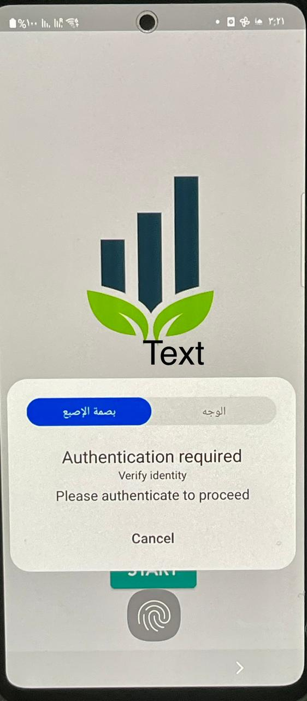

## How to Use 

**Step 1:**

Download or clone this repo by using the link below:

``` https://github.com/samahahmed22/flutter-bloc-charts-fingerprint ```

**Step 2:**
Go to projct root and execute following command in console :

`` flutter pub get ``

**Step 3:**

run the project by executing following command in console :

`` flutter run ``

<br />



<br />


<br />

